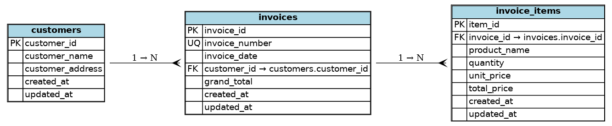

# Invoice Importer

A simple PHP library to import invoice data from Excel files and export it in various formats.

## What it does

- Import invoices from Excel files (.xlsx, .xls, .csv)
- Export data as JSON, XML, or Excel
- Store data in SQLite (default) or MySQL/PostgreSQL
- CLI tools for quick operations
- Basic web interface

## Quick Start

### 1. Install

```bash
git clone https://github.com/MohamedAlaa2104/invoice-importer.git
cd invoice-importer
composer install
```

### 2. Import your Excel file

```bash
php cli/import-invoices.php data/data.xlsx
```

### 3. Export the data

```bash
# Export as JSON
php cli/export-data.php --format=json

# Export as Excel
php cli/export-data.php --format=excel --output=my_export.xlsx

# Export specific customer
php cli/export-data.php --customer-id=1 --format=json
```

## Excel File Format

Your Excel file should look like this:

| Column | Description | Example |
|--------|-------------|---------|
| A | Invoice Number | 1 |
| B | Invoice Date | 2020年1月1日 |
| C | Customer Name | John Doe |
| D | Customer Address | 123 Main St |
| E | Product Name | Bread |
| F | Quantity | 2 |
| G | Unit Price | 10.50 |
| H | Line Total | 21.00 |
| I | Grand Total | 55.50 |

**Important**: Each row is an invoice item. Multiple rows with the same invoice number belong to the same invoice.

## CLI Commands

### Import

```bash
php cli/import-invoices.php <excel-file>
```

### Export

```bash
# Basic export
php cli/export-data.php --format=json

# Export to file
php cli/export-data.php --format=excel --output=export.xlsx

# Filter by customer
php cli/export-data.php --customer-id=1

# Filter by date range
php cli/export-data.php --start-date=2023-01-01 --end-date=2023-12-31

# Filter by amount
php cli/export-data.php --min-amount=100 --max-amount=1000
```

## Using in Your Code

### Import

```php
use Mohamedaladdin\InvoiceImporter\Database\Connection\DatabaseConnectionFactory;
use Mohamedaladdin\InvoiceImporter\Service\ExcelImportService;
use Mohamedaladdin\InvoiceImporter\Repository\CustomerRepository;
use Mohamedaladdin\InvoiceImporter\Repository\InvoiceRepository;
use Mohamedaladdin\InvoiceImporter\Repository\InvoiceItemRepository;

// Setup
$connection = DatabaseConnectionFactory::create();
$connection->connect();

$customerRepo = new CustomerRepository($connection);
$itemRepo = new InvoiceItemRepository($connection);
$invoiceRepo = new InvoiceRepository($connection, $customerRepo, $itemRepo);

$importService = new ExcelImportService($customerRepo, $invoiceRepo, $itemRepo);

// Import
$result = $importService->importFromFile('data.xlsx');
echo "Imported {$result->getSuccessCount()} invoices\n";
```

### Export

```php
use Mohamedaladdin\InvoiceImporter\Service\DataExportService;

$exportService = new DataExportService($invoiceRepo, $customerRepo);

// Export as JSON
$json = $exportService->exportAllInvoices('json');

// Export as Excel
$excel = $exportService->exportAllInvoices('excel');
file_put_contents('export.xlsx', $excel);

// Export specific customer
$customerData = $exportService->exportInvoicesByCustomer(1, 'json');
```

## Database Setup

### SQLite (Default)

No setup needed. The database file is created automatically at `database/invoices.db`.

### MySQL/PostgreSQL

1. Copy the example config:
```bash
cp env.example .env
```

2. Edit `.env` with your database settings:
```bash
DB_CONNECTION=mysql
DB_HOST=localhost
DB_DATABASE=invoices
DB_USERNAME=your_username
DB_PASSWORD=your_password
```

3. Create the database tables:
```bash
php cli/import-invoices.php data/data.xlsx
```

## Web Interface

Start a local server:
```bash
php -S localhost:8000 -t web
```

Visit `http://localhost:8000` to view your data.

## Testing

```bash
composer test
```

## Database Schema



The database consists of three main tables:
- **customers**: Stores customer information
- **invoices**: Stores invoice headers with customer references
- **invoice_items**: Stores individual items within each invoice

## File Structure

```
src/
├── Config/           # Configuration management
├── Database/         # Database connections and migrations
├── Entity/           # Data models (Customer, Invoice, InvoiceItem)
├── Exception/        # Custom exceptions
├── Repository/       # Data access layer
├── Service/          # Business logic
└── Utility/          # Helper classes

cli/                  # Command-line tools
web/                  # Web interface
tests/                # Unit tests
docs/                 # Documentation and diagrams
```

## Requirements

- PHP 8.0+
- Composer
- SQLite (default) or MySQL/PostgreSQL

## License

MIT